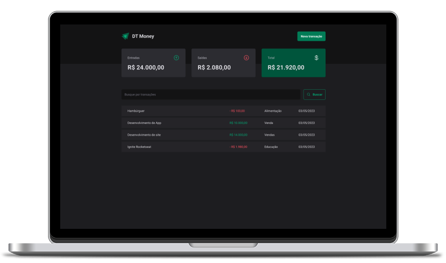

 

 

 

  
  
  

  

 

## 🚀 Features

1. **Add new transaction:** Provide a form where users can add a new income or outcome transaction by specifying the amount, category, and description.

2. **Transaction list:** Display a list of all transactions in a table with columns for date, category, description and amount.

3. **Summary of incomes, outcomes and total:** Show a summary of the user's total outcomes, incomes, and the difference between them as the total balance.

4. **Transaction search:** Allow users to search for specific transactions by category, description, or date range.

 

## 🛠️ Technologies

This application is built using the following technologies:

- [React](https://reactjs.org/)
- [TypeScript](https://www.typescriptlang.org/)
- [Vite](https://vitejs.dev/)
- [React Hooks](https://reactjs.org/docs/hooks-intro.html)

 

## 🚀 Getting Started

Follow these steps to get started with the Timer Application:

1. Clone the repository to your local machine.

2. Install dependencies using the command `npm install`.

3. Run JSON Server using the command `npm run dev:server`.

4. Start the development server using the command `npm run dev`.

5. In your browser, navigate to `http://localhost:5174` to access the application.

 

## 🚀 Creating a Production Build

To create a production build of the Timer Application, follow these steps:

1. Run the command `npm run build`.

2. The production-ready application will be generated in the `dist` directory.

3. Serve the production build using a server of your choice.

 

## 🤝 Contributing

Contributions to this project are welcome. To contribute, follow these steps:

1. Fork the repository.

2. Create a new branch.

3. Make your changes and commit them.

4. Push to the new branch.

5. Create a pull request.

 

## 📝 License

This project is licensed under the MIT License.